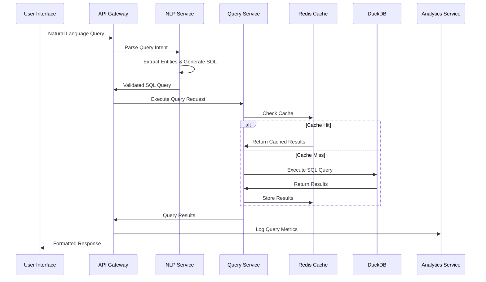

# CensusChat System Architecture

## Overview

CensusChat implements a modern three-layer architecture designed for high performance, scalability, and reliability. This architecture supports natural language queries on 11M+ Census records with sub-2 second response times while maintaining enterprise-grade security and compliance.

## Three-Layer Architecture

## Core Components

### User Interface Layer

#### Web Application
- **Technology**: React 18+ with TypeScript, Next.js 14+ for SSR
- **Features**: Natural language query interface, interactive dashboards, collaboration tools
- **Performance**: <3 second page load times, responsive design
- **Scalability**: CDN distribution, code splitting, lazy loading

#### Mobile Applications
- **Technology**: React Native for iOS and Android
- **Features**: Core query functionality, offline data access, push notifications
- **Performance**: Native performance with optimized data synchronization
- **User Experience**: Touch-optimized interface for field research

#### API Gateway
- **Technology**: Node.js 20+ with Express.js
- **Functionality**: Request routing, authentication, rate limiting, response transformation
- **Security**: JWT validation, input sanitization, CORS management
- **Monitoring**: Request/response logging, performance metrics, error tracking

### Processing Layer

#### Natural Language Processing Service
- **Technology**: Python 3.11+ with custom MCP implementation
- **Capabilities**: 
  - Intent recognition for demographic queries
  - Entity extraction (geographic areas, demographics, time periods)
  - SQL generation with optimization hints
  - Query validation and security constraints
- **Performance**: <500ms processing time for 95% of queries
- **Accuracy**: 95%+ query success rate with continuous learning

#### Query Processing Service
- **Technology**: Node.js with DuckDB integration
- **Functionality**:
  - SQL query execution and optimization
  - Result caching and materialized views
  - Geographic boundary processing
  - Statistical calculations and aggregations
- **Performance**: <2 second response times for complex queries
- **Scalability**: Horizontal scaling with query distribution

#### Authentication Service
- **Technology**: Node.js with JWT and OAuth 2.0
- **Features**:
  - Multi-provider authentication (Google, Microsoft, SAML)
  - Role-based access control (RBAC)
  - Session management with refresh tokens
  - Enterprise SSO integration
- **Security**: Token encryption, rate limiting, audit logging
- **Compliance**: SOC 2, GDPR, enterprise security standards

#### Analytics Service
- **Technology**: Node.js with event streaming
- **Capabilities**:
  - User behavior tracking and analysis
  - Query performance monitoring
  - Usage pattern identification
  - Predictive analytics for caching
- **Real-time**: Event processing with sub-second latency
- **Storage**: Time-series data with automated retention policies

#### User Management Service
- **Technology**: Node.js with PostgreSQL
- **Features**:
  - User profile management
  - Subscription and billing integration
  - Team and organization management
  - Usage quota enforcement
- **Scalability**: Database sharding for large user bases
- **Backup**: Automated backups with point-in-time recovery

### Data Layer

#### DuckDB Analytics Engine
- **Configuration**:
  - Memory allocation: 50% of available system memory
  - Thread pool: CPU count × 1.5 worker threads
  - Storage: NVMe SSD with S3 backup
- **Optimizations**:
  - Columnar storage for analytical workloads
  - Vectorized query execution
  - Custom indexes on geographic and demographic fields
  - Pre-computed aggregations for common patterns
- **Performance**: 10GB/s read throughput, sub-second query times
- **Reliability**: Continuous backup to S3, point-in-time recovery

#### Redis Cache Cluster
- **Configuration**:
  - Cluster mode with automatic failover
  - 6 nodes (3 primary, 3 replica) minimum
  - Memory optimization for large result sets
- **Caching Strategy**:
  - Query result caching with TTL policies
  - Geographic boundary caching
  - User session management
  - Frequently accessed data pre-loading
- **Performance**: <100ms cache retrieval times
- **Reliability**: Redis Sentinel for high availability

#### PostgreSQL User Database
- **Configuration**:
  - Primary-replica setup with read replicas
  - Connection pooling with PgBouncer
  - Automated backup and maintenance
- **Schema Design**:
  - User profiles and authentication data
  - Subscription and billing information
  - Team and organization structures
  - Audit logs and compliance data
- **Performance**: Optimized for OLTP workloads
- **Security**: Encryption at rest, access logging

#### S3 Data Storage
- **Structure**:
  - Raw Census data with versioning
  - Processed analytical datasets
  - User-generated content and exports
  - Backup and archival data
- **Organization**: Partitioned by data type and time period
- **Performance**: Intelligent tiering for cost optimization
- **Security**: Server-side encryption, IAM policies

## Data Flow Architecture

### Query Processing Flow

### Data Ingestion Pipeline

## Performance Specifications

### Response Time Targets
- **Simple Queries**: <500ms (95th percentile)
- **Complex Queries**: <2000ms (95th percentile)
- **Cached Results**: <100ms (frequently accessed data)
- **Geographic Queries**: <1000ms (spatial analysis)

### Scalability Targets
- **Concurrent Users**: 1,000+ simultaneous active users
- **Query Throughput**: 10,000+ queries per hour sustained
- **Data Volume**: 100GB+ with 20% annual growth capacity
- **Storage Performance**: 10GB/s read throughput

### Reliability Targets
- **System Uptime**: 99.9% availability (8.77 hours downtime/year)
- **Error Rate**: <0.1% failed requests under normal load
- **Recovery Time**: <15 minutes for complete service restoration
- **Data Consistency**: 100% accuracy for Census data replication

## Integration Architecture

### External API Integrations

### API Design Principles

#### RESTful API Standards
- **Resource-based URLs**: `/api/v1/queries`, `/api/v1/users`
- **HTTP methods**: GET, POST, PUT, DELETE for appropriate operations
- **Status codes**: Proper HTTP status code usage
- **Content negotiation**: JSON primary, CSV/XML support

#### Security Standards
- **Authentication**: Bearer token (JWT) required for all endpoints
- **Authorization**: Role-based access control (RBAC)
- **Rate limiting**: Per-user and per-endpoint limits
- **Input validation**: Comprehensive schema validation

#### Performance Standards
- **Response times**: <200ms for API responses (95th percentile)
- **Pagination**: Efficient cursor-based pagination for large result sets
- **Caching**: Aggressive caching with proper cache headers
- **Compression**: Gzip compression for all responses

## Deployment Architecture

The system is designed for containerized deployment using Kubernetes with support for multiple cloud providers and scaling scenarios. Detailed infrastructure specifications are covered in the Infrastructure Architecture document.

## Security Considerations

All components implement security-by-design principles with multiple layers of protection. Comprehensive security architecture details are provided in the Security Architecture document.

## Next Steps

This system architecture provides the foundation for:
1. **Microservices Architecture**: Detailed service boundaries and interactions
2. **Data Architecture**: Specific data modeling and flow patterns  
3. **Security Architecture**: Comprehensive security controls and compliance
4. **Infrastructure Architecture**: Deployment and operational considerations

Each architecture layer builds upon this system foundation to provide complete technical specifications for CensusChat implementation.