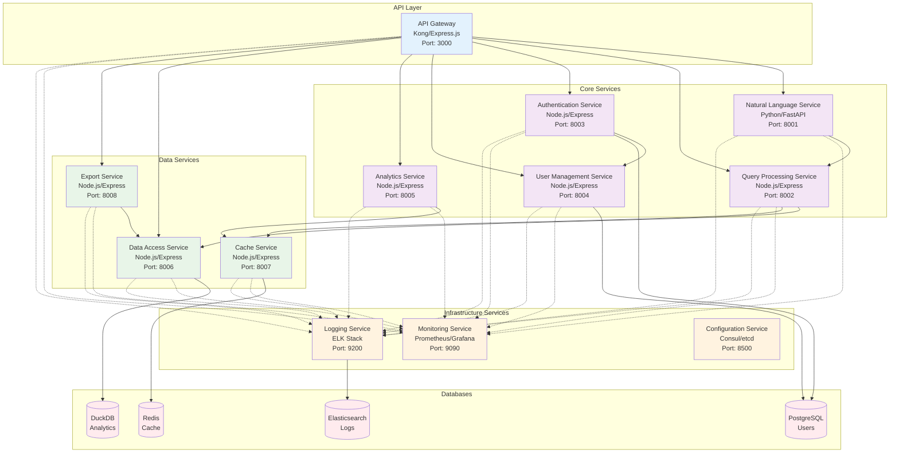
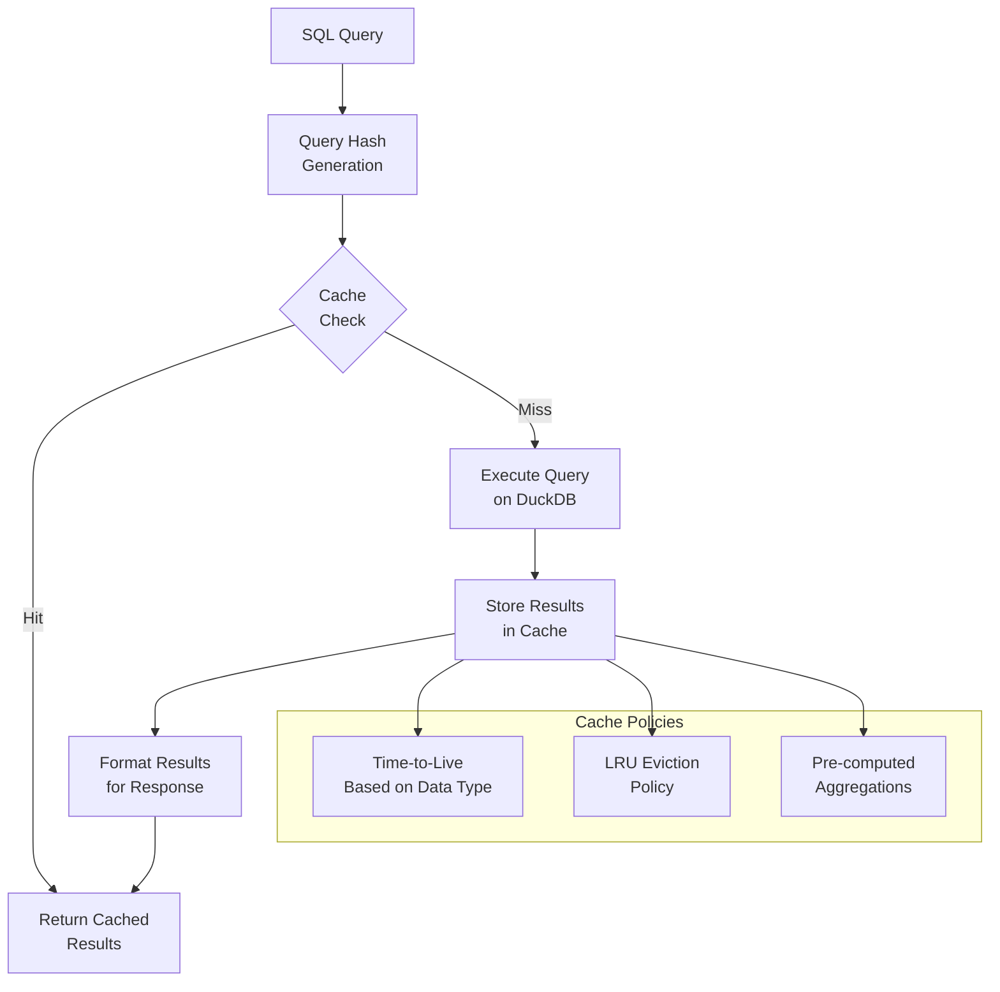
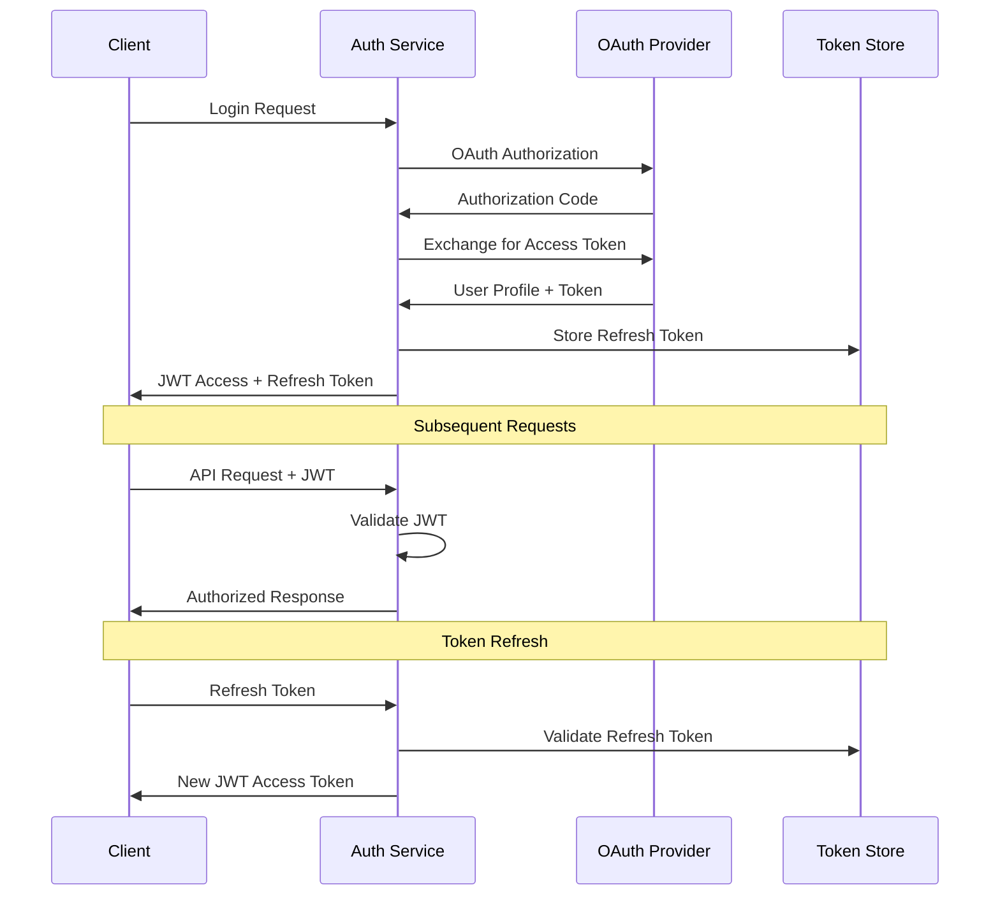
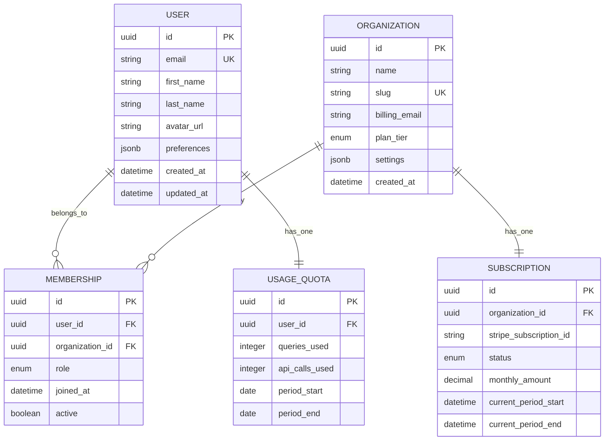
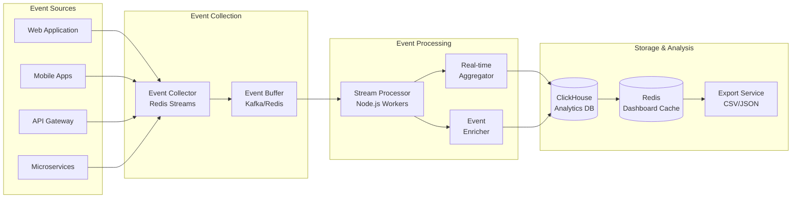
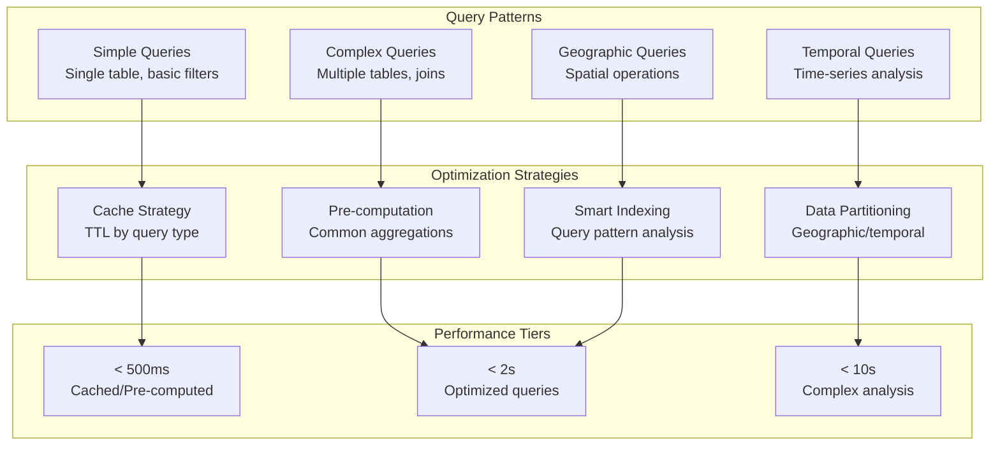

# CensusChat Microservices Architecture

## Overview

CensusChat implements a microservices architecture pattern to enable independent scaling, deployment, and maintenance of core platform capabilities. Each service is designed with single responsibility principles, well-defined APIs, and autonomous data management.

## Service Topology



## Service Specifications

### API Gateway Service

**Purpose**: Single entry point for all client requests with routing, authentication, and rate limiting.

**Technology Stack**:
- Framework: Kong API Gateway or Node.js/Express
- Load Balancer: nginx or cloud load balancer
- Service Discovery: Consul or Kubernetes DNS

**Core Responsibilities**:
- Request routing to appropriate microservices
- Authentication token validation
- Rate limiting and throttling
- Request/response transformation
- Cross-Origin Resource Sharing (CORS) management
- API versioning and backwards compatibility

**Key Features**:
```yaml
Routing:
  - Path-based routing: /api/v1/{service}/{resource}
  - Header-based routing for API versioning
  - Health check aggregation from all services

Authentication:
  - JWT token validation with public key verification
  - Service-to-service authentication with mutual TLS
  - Rate limiting per user and API key

Monitoring:
  - Request/response logging with correlation IDs
  - Performance metrics collection
  - Error rate tracking and alerting
```

**Performance Requirements**:
- Response time: <50ms overhead for request routing
- Throughput: 10,000+ requests per minute
- Availability: 99.95% uptime with health checks

**API Endpoints**:
```
GET  /health                    - Health check aggregation
GET  /metrics                   - Prometheus metrics
POST /api/v1/auth/*            - Authentication routes
GET  /api/v1/queries/*         - Query processing routes
GET  /api/v1/users/*           - User management routes
GET  /api/v1/analytics/*       - Analytics routes
```

### Natural Language Processing Service

**Purpose**: Convert natural language queries into validated SQL statements optimized for demographic analysis.

**Technology Stack**:
- Framework: Python 3.11+ with FastAPI
- ML Libraries: spaCy, transformers, scikit-learn
- Queue: Redis for background processing
- Model Storage: S3 for trained models

**Core Responsibilities**:
- Intent recognition for demographic queries
- Named entity recognition (geographic areas, demographics)
- SQL query generation with optimization hints
- Query validation and security constraint enforcement
- Model training and continuous improvement

**Key Features**:
```yaml
Intent Recognition:
  - Demographic analysis queries (population, income, education)
  - Geographic queries (states, counties, metro areas, tracts)
  - Temporal queries (year-over-year comparisons, trends)
  - Statistical queries (averages, medians, percentiles)

Entity Extraction:
  - Geographic entities: FIPS codes, place names, boundaries
  - Demographic variables: age groups, race, income brackets
  - Time periods: years, date ranges, comparison periods
  - Statistical measures: counts, percentages, margins of error

SQL Generation:
  - Template-based query construction
  - Parameter validation and sanitization
  - Query optimization hints for DuckDB
  - Security constraints (SELECT-only, subquery limits)
```

**Machine Learning Pipeline**:

```mermaid
graph LR
    INPUT[Natural Language<br/>Query] --> PREPROCESS[Text Preprocessing<br/>Tokenization]
    PREPROCESS --> NER[Named Entity<br/>Recognition]
    NER --> INTENT[Intent<br/>Classification]
    INTENT --> TEMPLATE[Template<br/>Selection]
    TEMPLATE --> PARAMS[Parameter<br/>Extraction]
    PARAMS --> SQL[SQL Query<br/>Generation]
    SQL --> VALIDATE[Query<br/>Validation]
    VALIDATE --> OUTPUT[Validated SQL<br/>Query]
    
    %% Feedback loop
    OUTPUT -.-> FEEDBACK[User Feedback<br/>& Corrections]
    FEEDBACK -.-> RETRAIN[Model<br/>Retraining]
    RETRAIN -.-> NER
```


**Performance Requirements**:
- Processing time: <500ms for 95% of queries
- Accuracy: 95%+ successful query generation
- Throughput: 1,000+ queries per minute per instance
- Model updates: Weekly retraining with user feedback

**API Endpoints**:
```
POST /nlp/parse                 - Parse natural language query
POST /nlp/validate              - Validate generated SQL
GET  /nlp/suggestions          - Get query suggestions
POST /nlp/feedback             - Submit user feedback
GET  /nlp/health               - Service health check
```

### Query Processing Service

**Purpose**: Execute SQL queries against DuckDB with optimization, caching, and result formatting.

**Technology Stack**:
- Framework: Node.js 20+ with Express.js
- Database: DuckDB with custom extensions
- Cache: Redis for query result caching
- Queue: Bull for background processing

**Core Responsibilities**:
- SQL query execution with timeout management
- Query result caching with intelligent TTL
- Result formatting for different output types
- Query performance monitoring and optimization
- Geographic boundary processing

**Key Features**:
```yaml
Query Execution:
  - Parameterized query execution with prepared statements
  - Query timeout enforcement (30 seconds maximum)
  - Result set size limits (1M rows maximum)
  - Connection pooling with automatic failover

Caching Strategy:
  - Query result caching with hash-based keys
  - Intelligent TTL based on data freshness
  - Geographic boundary caching for spatial queries
  - Aggregation result pre-computation

Performance Optimization:
  - Query plan analysis and optimization hints
  - Index usage monitoring and recommendations
  - Parallel query execution for large datasets
  - Memory usage optimization for large result sets
```

**Caching Architecture**:


**Performance Requirements**:
- Query execution: <2 seconds for 95% of queries
- Cache hit ratio: >80% for frequently accessed data
- Memory usage: <8GB per instance under normal load
- Concurrent queries: 100+ simultaneous executions

**API Endpoints**:
```
POST /query/execute             - Execute SQL query
GET  /query/cache/{hash}       - Get cached query result
POST /query/explain            - Get query execution plan
GET  /query/stats              - Query performance statistics
POST /query/cancel/{queryId}   - Cancel running query
```

### Authentication Service

**Purpose**: Handle user authentication, authorization, and session management across all platform services.

**Technology Stack**:
- Framework: Node.js 20+ with Express.js
- Authentication: Passport.js with multiple strategies
- JWT: jsonwebtokenpackage with RS256 signing
- Database: PostgreSQL for user credentials

**Core Responsibilities**:
- Multi-provider authentication (OAuth, SAML)
- JWT token generation and validation
- Role-based access control (RBAC)
- Session management with refresh tokens
- Password security and multi-factor authentication

**Key Features**:
```yaml
Authentication Providers:
  - Google OAuth 2.0
  - Microsoft Azure AD / Office 365
  - GitHub OAuth (for developers)
  - SAML 2.0 for enterprise customers
  - Username/password with bcrypt hashing

Token Management:
  - JWT access tokens (15-minute expiration)
  - Refresh tokens (30-day expiration with rotation)
  - Token blacklisting for logout
  - Asymmetric key signing (RS256)

Authorization:
  - Role-based access control (Admin, User, Analyst)
  - Permission-based access to features
  - Organization-level access control
  - API rate limiting per user tier
```

**Authentication Flow**:


**Security Features**:
- Password policy enforcement (complexity, expiration)
- Multi-factor authentication (TOTP, SMS)
- Account lockout after failed attempts
- Audit logging for all authentication events
- IP-based access restrictions for enterprise accounts

**Performance Requirements**:
- Token validation: <10ms per request
- Login processing: <500ms for OAuth flows
- Concurrent sessions: 10,000+ active users
- Token cache hit ratio: >95% for validation requests

**API Endpoints**:
```
POST /auth/login               - Username/password login
GET  /auth/oauth/{provider}    - OAuth provider redirect
POST /auth/oauth/callback      - OAuth callback handler
POST /auth/refresh             - Refresh JWT token
POST /auth/logout              - Logout and invalidate tokens
GET  /auth/profile             - Get user profile
POST /auth/mfa/setup           - Setup multi-factor auth
```

### User Management Service

**Purpose**: Manage user profiles, subscriptions, teams, and organizational structures.

**Technology Stack**:
- Framework: Node.js 20+ with Express.js
- Database: PostgreSQL with connection pooling
- Cache: Redis for session and profile caching
- Queue: Bull for background user operations

**Core Responsibilities**:
- User profile and preference management
- Subscription and billing integration
- Team and organization management
- Usage quota tracking and enforcement
- User analytics and behavior tracking

**Key Features**:
```yaml
Profile Management:
  - User profile creation and updates
  - Preference settings (themes, notifications)
  - Avatar and personal information storage
  - Privacy settings and data preferences

Subscription Management:
  - Plan tier management (Free, Professional, Team, Enterprise)
  - Usage quota tracking and enforcement
  - Billing integration with Stripe/Paddle
  - Invoice and payment history

Organization Management:
  - Team creation and member management
  - Role assignments within organizations
  - Shared workspace and collaboration features
  - Enterprise account provisioning
```

**Data Model**:


**Performance Requirements**:
- Profile retrieval: <100ms for cached profiles
- User operations: <200ms for standard CRUD operations
- Organization queries: <300ms for large team structures
- Concurrent users: Support for 50,000+ registered users

**API Endpoints**:
```
GET    /users/profile          - Get current user profile
PUT    /users/profile          - Update user profile
GET    /users/organizations    - Get user organizations
POST   /organizations          - Create new organization
PUT    /organizations/{id}     - Update organization
GET    /organizations/{id}/members - Get organization members
POST   /organizations/{id}/invite  - Invite team member
GET    /users/usage            - Get usage statistics
```

### Analytics Service

**Purpose**: Collect, process, and provide insights on user behavior, query patterns, and system performance.

**Technology Stack**:
- Framework: Node.js 20+ with Express.js
- Analytics: Custom event tracking with Redis Streams
- Database: ClickHouse for time-series analytics data
- Visualization: Chart.js and D3.js for dashboards

**Core Responsibilities**:
- User behavior tracking and analysis
- Query pattern analysis and optimization insights
- System performance monitoring and alerting
- Business intelligence for product decisions
- Real-time dashboard and reporting

**Key Features**:
```yaml
Event Tracking:
  - User interaction tracking (queries, exports, shares)
  - Performance metrics (response times, error rates)
  - Feature adoption tracking
  - A/B test data collection

Analytics Dashboard:
  - Real-time user activity monitoring
  - Query performance analytics
  - Feature usage statistics
  - Revenue and conversion metrics

Insights Generation:
  - Popular query patterns identification
  - Geographic data access trends
  - User engagement scoring
  - Churn prediction modeling
```

**Event Processing Pipeline**:


**Performance Requirements**:
- Event ingestion: 10,000+ events per minute
- Dashboard queries: <500ms for real-time data
- Data retention: 2 years with automated archiving
- Report generation: <2 seconds for standard reports

**API Endpoints**:
```
POST /analytics/events         - Submit analytics event
GET  /analytics/dashboard      - Get dashboard data
GET  /analytics/queries        - Get query analytics
GET  /analytics/users          - Get user analytics
GET  /analytics/export         - Export analytics data
```

### Data Access Service

**Purpose**: Provide abstracted, optimized access to Census data with caching and performance optimization.

**Technology Stack**:
- Framework: Node.js 20+ with Express.js
- Database: DuckDB with custom optimization
- Cache: Redis with intelligent caching strategies
- Background Jobs: Bull for data refresh operations

**Core Responsibilities**:
- Optimized data access patterns for Census data
- Geographic boundary processing and caching
- Data freshness monitoring and updates
- Statistical calculation optimization
- Data export preparation and formatting

**Key Features**:
```yaml
Data Access Optimization:
  - Intelligent query routing based on data patterns
  - Pre-computed aggregations for common queries
  - Geographic hierarchy optimization
  - Statistical calculation caching

Data Management:
  - Census data version management
  - Geographic boundary updates
  - Data quality monitoring and validation
  - Automated data refresh scheduling

Export Capabilities:
  - Multi-format export (CSV, JSON, Excel, PDF)
  - Large dataset streaming for enterprise users
  - Custom formatting and branding options
  - Scheduled export generation
```

**Data Access Patterns**:


**Performance Requirements**:
- Simple queries: <500ms response time
- Complex queries: <2 seconds response time
- Cache hit ratio: >85% for common queries
- Data freshness: <24 hours from Census Bureau updates

**API Endpoints**:
```
GET  /data/census/{table}      - Get Census table data
POST /data/query               - Execute optimized query
GET  /data/boundaries/{type}   - Get geographic boundaries
GET  /data/metadata/{dataset}  - Get dataset metadata
POST /data/export              - Generate data export
```

## Service Communication Patterns

### Synchronous Communication

**REST API Calls**:
- Service-to-service communication for real-time operations
- HTTP/1.1 with connection pooling for performance
- Circuit breaker pattern for fault tolerance
- Retry policies with exponential backoff

**API Gateway Routing**:
- Central routing for all external requests
- Load balancing across service instances
- Health checks and automatic failover
- Request/response transformation

### Asynchronous Communication

**Event-Driven Architecture**:
- Redis Streams for high-throughput event processing
- Event sourcing for audit trails and data consistency
- Saga pattern for distributed transactions
- Dead letter queues for error handling

**Message Queues**:
- Background job processing with Bull queues
- Delayed job execution for scheduled operations
- Priority queues for different operation types
- Job retry and failure handling

### Service Discovery and Configuration

**Service Registry**:
- Kubernetes DNS for service discovery
- Health check endpoints for all services
- Rolling deployment with zero-downtime updates
- Environment-specific configuration management

**Configuration Management**:
- Environment variables for service configuration
- Secrets management with Kubernetes secrets
- Feature flags for gradual rollouts
- Configuration hot-reloading for dynamic updates

## Scaling Strategies

### Horizontal Scaling

**Stateless Services**:
- All services designed as stateless for easy horizontal scaling
- Load balancing with round-robin and health-based routing
- Auto-scaling based on CPU, memory, and request metrics
- Kubernetes HPA (Horizontal Pod Autoscaler) integration

**Database Scaling**:
- Read replicas for PostgreSQL user database
- Redis Cluster for distributed caching
- DuckDB with partition-based scaling
- Connection pooling to optimize database connections

### Vertical Scaling

**Resource Optimization**:
- Memory and CPU profiling for optimal resource allocation
- Garbage collection tuning for Node.js services
- JVM tuning for services requiring JVM (if any)
- Container resource limits and requests optimization

## Monitoring and Observability

### Application Monitoring

**Metrics Collection**:
- Prometheus metrics for all services
- Custom business metrics for KPI tracking
- Performance metrics (response time, throughput)
- Error rate monitoring with alerting

**Distributed Tracing**:
- Request correlation IDs across all services
- Jaeger or Zipkin for distributed tracing
- Performance bottleneck identification
- Service dependency mapping

### Health Checks

**Service Health**:
- HTTP health check endpoints for all services
- Database connectivity checks
- External dependency health verification
- Kubernetes liveness and readiness probes

**Circuit Breakers**:
- Fault tolerance for service-to-service communication
- Automatic failover and recovery
- Graceful degradation under load
- Performance threshold monitoring

This microservices architecture provides the foundation for a scalable, maintainable, and resilient CensusChat platform capable of supporting millions of queries and thousands of concurrent users while maintaining sub-2 second response times.