# CensusChat Data Architecture

## Overview

CensusChat's data architecture is designed to handle 11M+ Census records with sub-2 second query performance while maintaining data quality, consistency, and scalability. The architecture implements a modern lakehouse pattern combining operational and analytical workloads with intelligent caching and optimization strategies.

## Data Architecture Layers


## Core Data Assets

### Census ACS 5-Year Dataset

**Dataset Specifications**:
- **Volume**: 44GB compressed, 250+ tables, 10,000+ variables
- **Records**: 11M+ demographic records across all geographic levels
- **Coverage**: National → State → County → Metro → Tract → Block Group
- **Temporal**: 2009-present with annual updates
- **Quality**: 90%+ response rates, government-authoritative methodology

**Data Structure**:


**Key Tables and Variables**:
```yaml
Population Demographics:
  - B01001: Sex by Age
  - B25001: Housing Units
  - B08303: Travel Time to Work
  - B19013: Median Household Income

Economic Data:
  - B25064: Median Gross Rent
  - B25077: Median Value (Owner-Occupied Housing)
  - B08124: Means of Transportation to Work
  - C24010: Sex by Occupation

Educational Attainment:
  - B15003: Educational Attainment
  - B14001: School Enrollment
  - B07009: Geographical Mobility by Educational Attainment

Race and Ethnicity:
  - B02001: Race
  - B03002: Hispanic or Latino Origin by Race
  - B25003: Tenure by Race of Householder
```

### Geographic Intelligence

**Geographic Hierarchy**:


**Boundary Data Storage**:
```yaml
Storage Format:
  - Raw: TIGER/Line Shapefiles from Census Bureau
  - Processed: GeoJSON and Parquet with spatial indexes
  - Simplified: Multiple resolution levels for performance
  - Cached: Pre-computed boundary relationships

Spatial Indexing:
  - R-Tree index for efficient spatial queries
  - QuadTree index for geographic visualization
  - Boundary intersection pre-computation
  - Distance calculation optimization

Update Frequency:
  - Annual updates from Census Bureau TIGER/Line
  - Immediate updates for boundary corrections
  - Version control for historical boundary changes
  - Automated validation of boundary topology
```

## DuckDB Analytics Engine

### Configuration and Optimization

**DuckDB Configuration**:
```sql
-- Memory and Threading
SET memory_limit = '32GB';
SET threads = 16;
SET max_memory = '75%';

-- Performance Optimizations
SET enable_object_cache = true;
SET preserve_insertion_order = false;
SET enable_profiling = true;

-- Storage Configuration
SET temp_directory = '/tmp/duckdb';
SET default_order = 'ASC';
```

**Storage Layout**:


**Partitioning Strategy**:
```yaml
Temporal Partitioning:
  - Partition by year for time-series queries
  - Separate partitions for each ACS release
  - Automated partition pruning for date ranges
  - Parallel processing across partitions

Geographic Partitioning:
  - State-level partitioning for large queries
  - Regional groupings for cross-state analysis
  - Urban/rural partitioning for demographic patterns
  - FIPS code range partitioning for spatial queries

Variable Partitioning:
  - Subject-based partitioning (demographics, economics, housing)
  - Table-level partitioning for related variables
  - Frequently accessed variables in hot partitions
  - Archive partitions for historical data
```

### Query Optimization Patterns

**Common Query Patterns**:
```sql
-- Geographic Aggregation Pattern
SELECT 
    g.name,
    SUM(d.estimate) as total_population,
    AVG(CASE WHEN d.variable_id = 'B19013_001E' THEN d.estimate END) as median_income
FROM geography g
JOIN demographic_data d ON g.geoid = d.geoid
WHERE g.geography_type = 'county'
    AND g.state_code = '06'  -- California
    AND d.year = 2022
GROUP BY g.geoid, g.name;

-- Time Series Pattern
WITH yearly_data AS (
    SELECT 
        year,
        SUM(CASE WHEN variable_id = 'B01001_001E' THEN estimate END) as population
    FROM demographic_data d
    JOIN geography g ON d.geoid = g.geoid
    WHERE g.geography_type = 'state'
        AND g.state_code = '06'
    GROUP BY year
)
SELECT 
    year,
    population,
    LAG(population) OVER (ORDER BY year) as prev_population,
    ((population - LAG(population) OVER (ORDER BY year)) / 
     LAG(population) OVER (ORDER BY year) * 100) as growth_rate
FROM yearly_data
ORDER BY year;

-- Spatial Proximity Pattern
SELECT 
    target.name as target_area,
    nearby.name as nearby_area,
    ST_Distance(target.boundary, nearby.boundary) as distance_miles
FROM geography target
CROSS JOIN geography nearby
WHERE target.geoid = '06037'  -- Los Angeles County
    AND nearby.geography_type = 'county'
    AND ST_DWithin(target.boundary, nearby.boundary, 100000)  -- 100km
    AND target.geoid != nearby.geoid
ORDER BY distance_miles
LIMIT 10;
```

**Performance Optimizations**:
```yaml
Index Strategies:
  - Composite indexes on (geoid, year, variable_id)
  - Spatial indexes using R-Tree for geographic queries
  - Hash indexes for exact match lookups
  - Covering indexes to avoid table lookups

Query Execution:
  - Vectorized execution for analytical workloads
  - Parallel processing across CPU cores
  - Memory-mapped file access for large datasets
  - Lazy evaluation for nested queries

Materialized Views:
  - Pre-computed aggregations for common queries
  - Geographic summary tables by administrative level
  - Time-series aggregations for trend analysis
  - Statistical summaries with confidence intervals
```

## Caching Architecture

### Redis Cluster Configuration

**Cluster Topology**:


**Caching Strategies**:
```yaml
Query Result Caching:
  - Key Pattern: "query:{hash}:{user_tier}"
  - TTL: 1 hour for real-time data, 24 hours for historical
  - Eviction: LRU with memory pressure monitoring
  - Compression: Gzip compression for large result sets

Geographic Boundary Caching:
  - Key Pattern: "geo:{type}:{fips}:{resolution}"
  - TTL: 7 days (boundaries change infrequently)
  - Preloading: Warm cache with frequently accessed boundaries
  - Serialization: MessagePack for efficient storage

Session and User Caching:
  - Key Pattern: "session:{user_id}" and "profile:{user_id}"
  - TTL: 24 hours for sessions, 1 hour for profiles
  - Invalidation: Immediate on profile updates
  - Security: Encrypted session data

Aggregation Caching:
  - Key Pattern: "agg:{table}:{geography}:{year}"
  - TTL: 6 hours for statistical aggregations
  - Pre-computation: Background jobs for popular aggregations
  - Warming: Predictive cache warming based on usage patterns
```

### Cache Performance Optimization

**Memory Management**:
```yaml
Memory Allocation:
  - 70% for query results (most volatile)
  - 20% for geographic data (stable, frequently accessed)
  - 10% for session data (small but critical)

Eviction Policies:
  - Query Cache: LRU with usage frequency weighting
  - Geographic Cache: TTL-based with manual eviction
  - Session Cache: TTL-based with idle timeout

Monitoring:
  - Hit ratio target: >85% overall, >90% for geographic data
  - Memory usage alerts at 80% capacity
  - Latency monitoring with <1ms target for cache hits
  - Eviction rate monitoring to optimize TTL values
```

## Data Pipeline Architecture

### ETL Pipeline

**Data Ingestion Flow**:


**Pipeline Configuration**:
```yaml
Scheduling:
  - Daily monitoring for new Census releases
  - Weekly full data refresh and validation
  - Monthly historical data archive and cleanup
  - Quarterly geographic boundary updates

Error Handling:
  - Retry logic with exponential backoff
  - Dead letter queue for failed records
  - Data quality threshold enforcement
  - Automatic rollback on validation failures

Monitoring:
  - Pipeline execution time tracking
  - Data quality metric collection
  - Error rate monitoring and alerting
  - Resource utilization optimization

Scalability:
  - Parallel processing for large datasets
  - Dynamic resource allocation based on data volume
  - Horizontal scaling for peak processing periods
  - Queue-based processing for consistent throughput
```

### Data Quality Framework

**Quality Dimensions**:
```yaml
Accuracy:
  - Cross-validation with multiple Census sources
  - Statistical consistency checks across geographic levels
  - Margin of error validation for survey data
  - Historical trend validation for outlier detection

Completeness:
  - Required field validation for all records
  - Geographic coverage verification
  - Variable availability checking across years
  - Missing data pattern analysis and reporting

Consistency:
  - Cross-table relationship validation
  - Geographic hierarchy integrity checks
  - Temporal consistency across data releases  
  - Unit of measurement standardization

Timeliness:
  - Data freshness monitoring and alerts
  - Processing time optimization and tracking
  - User notification for delayed updates
  - SLA compliance monitoring for data delivery

Validity:
  - Data type and format validation
  - Range and constraint checking
  - Business rule enforcement
  - Schema compliance verification
```

**Quality Monitoring Dashboard**:

```mermaid
graph TB
    subgraph "Data Quality Metrics"
        ACCURACY[Accuracy Score<br/>95.8%<br/>✅ Target: >95%]
        COMPLETENESS[Completeness<br/>99.2%<br/>✅ Target: >99%]
        TIMELINESS[Data Freshness<br/>18 hours<br/>✅ Target: <24h]
        CONSISTENCY[Consistency<br/>97.1%<br/>⚠️ Target: >98%]
    end
    
    subgraph "Quality Trends"
        TREND_CHART[Quality Trend<br/>30-day Rolling Average<br/>📈 Improving]
        ISSUE_LOG[Recent Issues<br/>2 Open, 15 Resolved<br/>🔧 Action Required]
    end
    
    subgraph "Automated Actions"
        ALERT[Quality Alert<br/>Consistency Below Target<br/>📧 Team Notified]
        REMEDIATION[Auto-Remediation<br/>Schema Validation Fix<br/>✅ Applied]
    end
    
    ACCURACY --> TREND_CHART
    COMPLETENESS --> TREND_CHART
    TIMELINESS --> TREND_CHART
    CONSISTENCY --> ISSUE_LOG
    
    CONSISTENCY --> ALERT
    ALERT --> REMEDIATION
```


## Data Governance and Security

### Data Access Control

**Role-Based Access Control**:
```yaml
Data Access Tiers:
  Public Data:
    - Pre-aggregated Census data (no individual records)
    - Geographic boundaries and metadata
    - Public documentation and schemas
    - Read-only access for all users

  Professional Data:
    - Full table access with query limits
    - Historical data across all years
    - Advanced statistical calculations
    - Export capabilities with attribution

  Enterprise Data:
    - Unlimited query access and API calls
    - Custom data processing and analysis
    - Bulk export and integration capabilities
    - Priority support and custom schemas

  Administrative Data:
    - User management and analytics data
    - System performance and usage metrics
    - Data quality and pipeline monitoring
    - Configuration and security settings
```

**Data Privacy Framework**:
```yaml
Privacy by Design:
  - No personally identifiable information (PII) in Census data
  - Aggregated data only (minimum population thresholds)
  - Automatic data minimization and retention policies
  - Privacy impact assessments for new data sources

Compliance Standards:
  - GDPR compliance for EU users (data portability, deletion)
  - CCPA compliance for California residents
  - SOC 2 Type II certification for enterprise customers
  - FedRAMP compliance pathway for government users

Data Retention:
  - Raw data: 7 years with automated archival
  - Processed data: 5 years in active storage
  - User data: Account lifetime plus 30 days
  - Logs and analytics: 2 years with anonymization
```

### Backup and Disaster Recovery

**Backup Strategy**:


**Recovery Procedures**:
```yaml
Recovery Time Objectives (RTO):
  - Critical Services: < 15 minutes
  - Query Processing: < 30 minutes
  - Full System: < 2 hours
  - Historical Data: < 4 hours

Recovery Point Objectives (RPO):
  - User Data: < 1 minute (continuous replication)
  - Query Cache: < 15 minutes (acceptable loss)
  - Analytics Data: < 1 hour (can be regenerated)
  - Configuration: < 5 minutes (version controlled)

Testing Schedule:
  - Monthly: Automated backup integrity checks
  - Quarterly: Disaster recovery drills with full team
  - Annually: Complete system recovery simulation
  - Ad-hoc: Post-incident recovery validation
```

## Performance Monitoring

### Database Performance Metrics

**DuckDB Monitoring**:
```yaml
Query Performance:
  - Average query execution time by complexity
  - 95th percentile response times for different query types
  - Query throughput (queries per second)
  - Slow query identification and optimization opportunities

Resource Utilization:
  - Memory usage patterns and peak allocation
  - CPU utilization during query processing
  - I/O throughput for data loading and queries
  - Network bandwidth utilization for result delivery

Connection Management:
  - Active connection count and pool utilization
  - Connection creation and termination rates
  - Query queue depth and wait times
  - Connection timeout and error rates
```

**Cache Performance Metrics**:
```yaml
Redis Cluster Monitoring:
  - Cache hit ratio by data type and time period
  - Memory utilization and eviction rates
  - Network latency between cluster nodes
  - Failover frequency and recovery times

Cache Effectiveness:
  - Query result cache hit ratio (target: >85%)
  - Geographic data cache hit ratio (target: >90%)
  - Session cache hit ratio (target: >95%)
  - Cache warming effectiveness and timing

Performance Impact:
  - Response time improvement from caching
  - Database load reduction through cache hits
  - Cost savings from reduced database queries
  - User experience improvement metrics
```

This comprehensive data architecture provides the foundation for CensusChat's high-performance analytical capabilities while maintaining data quality, security, and scalability requirements.