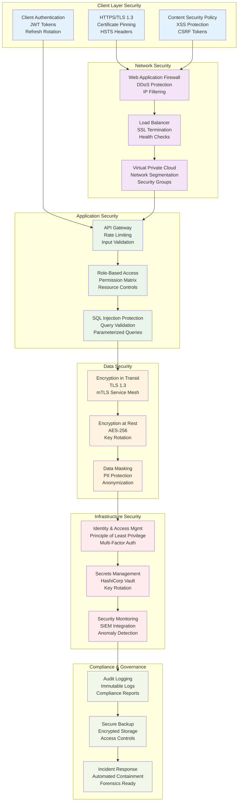
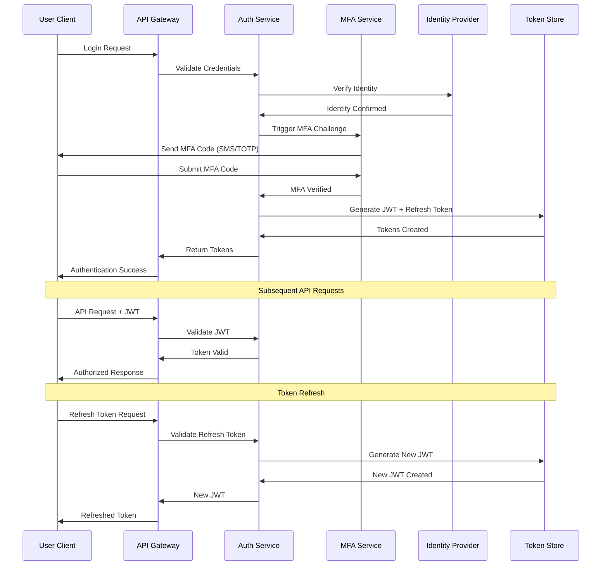
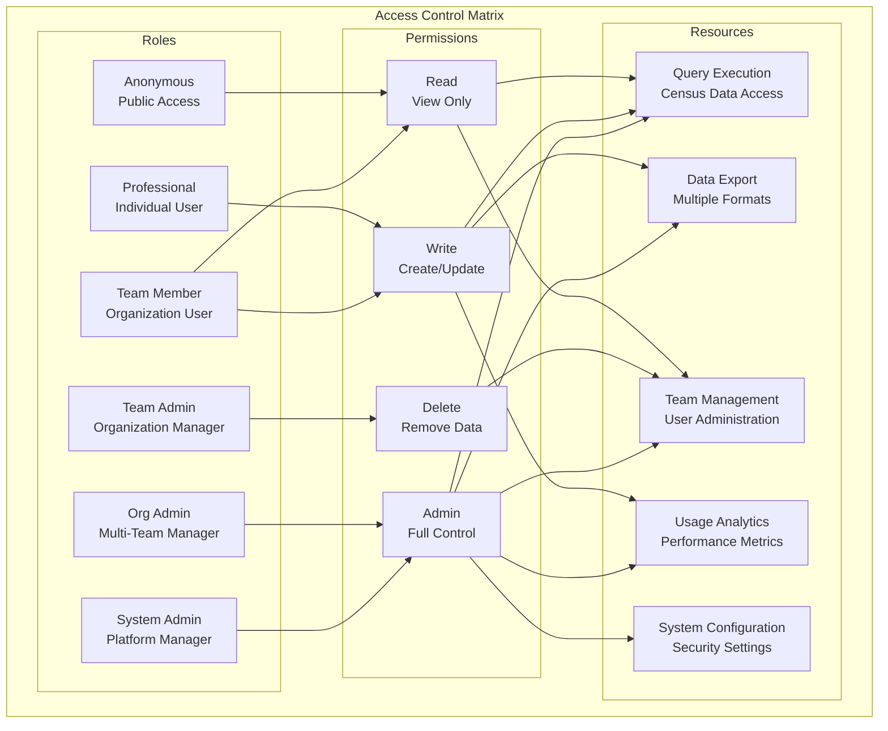
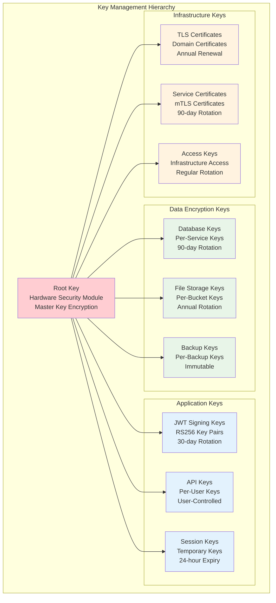
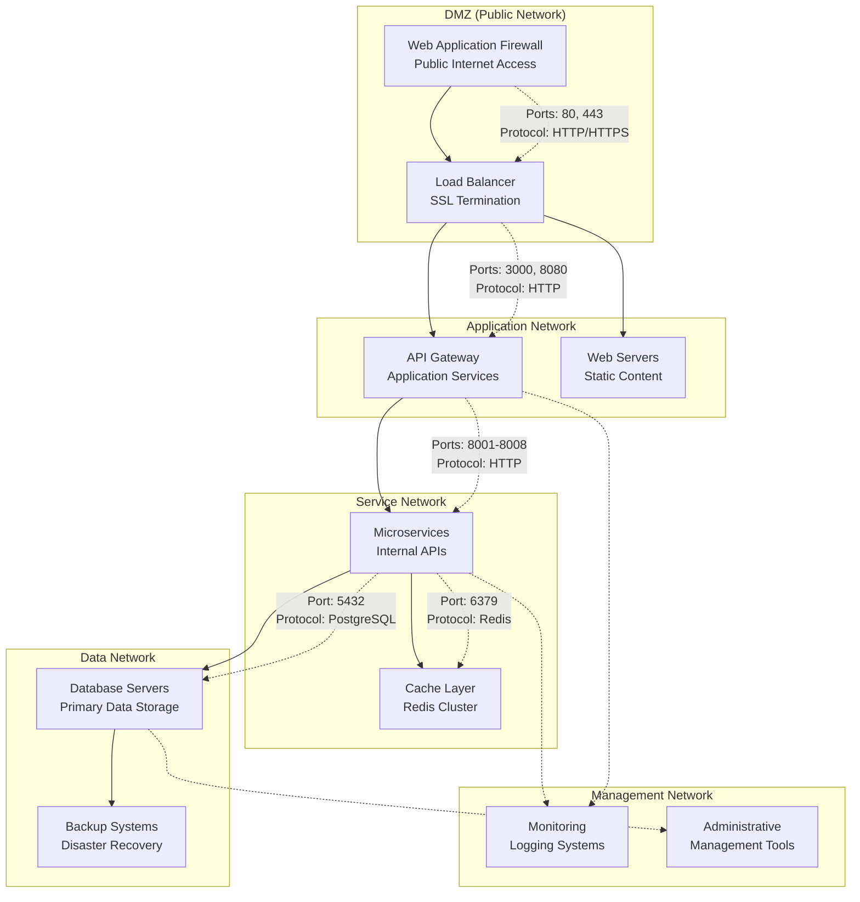
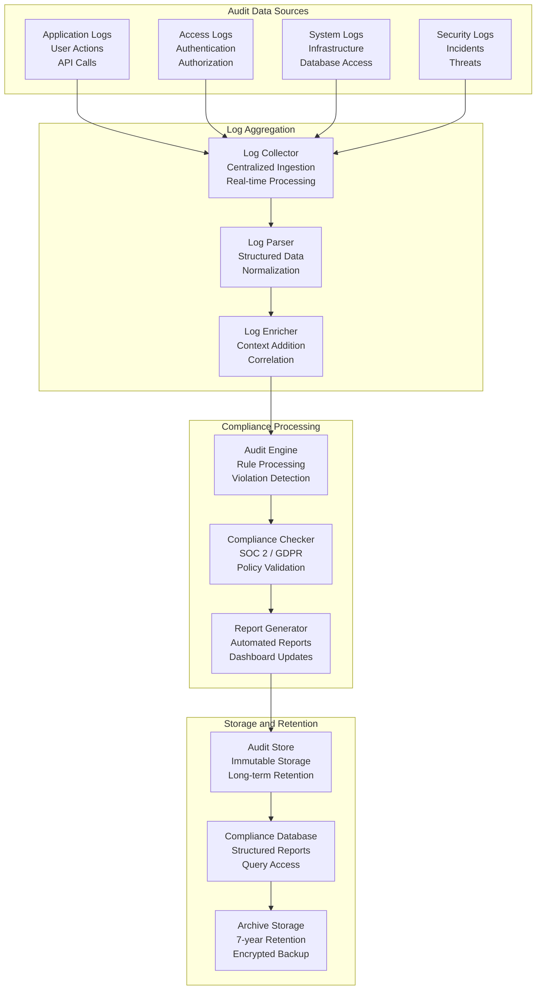

# CensusChat Security Architecture

## Overview

CensusChat implements a defense-in-depth security architecture designed to protect user data, prevent unauthorized access, and maintain compliance with enterprise security standards. The architecture follows zero-trust principles with multiple layers of protection across application, data, and infrastructure components.

## Security Architecture Overview



## Authentication and Authorization

### Multi-Factor Authentication Framework

**Authentication Flow**:


**Authentication Methods**:
```yaml
Primary Authentication:
  OAuth 2.0 Providers:
    - Google OAuth 2.0 (OpenID Connect)
    - Microsoft Azure AD / Office 365
    - GitHub OAuth (for developer accounts)
    - Custom SAML 2.0 for enterprise customers
  
  Username/Password:
    - bcrypt hashing with salt (cost factor: 12)
    - Password complexity requirements
    - Account lockout after 5 failed attempts
    - Password history tracking (last 12 passwords)

Multi-Factor Authentication:
  Time-based OTP (TOTP):
    - RFC 6238 compliant (Google Authenticator, Authy)
    - 30-second time windows with 1 window tolerance
    - Base32 encoded secrets with 160-bit entropy
    - Backup codes (8 single-use codes)
  
  SMS Authentication:
    - Twilio integration with rate limiting
    - Geographic restrictions for high-risk countries
    - Fallback for users without TOTP capability
    - Message encryption and audit logging

Enterprise Authentication:
  SAML 2.0:
    - Identity Provider initiated (IdP) and Service Provider (SP) flows
    - Attribute mapping for user roles and permissions
    - Digital signature validation and encryption
    - Support for major enterprise IdPs (Okta, Ping, ADFS)
  
  LDAP Integration:
    - Secure LDAP (LDAPS) connections
    - Active Directory group mapping
    - Nested group support for complex organizations
    - Connection pooling and failover
```

### Role-Based Access Control (RBAC)

**Permission Matrix**:
```yaml
Role Definitions:
  Anonymous:
    - View public documentation
    - Access free tier query limits (100 queries/month)
    - No data export capabilities
    - Community support only

  Individual Professional:
    - Unlimited queries with priority processing
    - All export formats (CSV, JSON, Excel, PDF)
    - Basic collaboration features
    - Email support with 24-hour SLA

  Team Member:
    - All Professional features
    - Team workspace access
    - Advanced collaboration and sharing
    - Query template sharing within organization
    - Priority phone support

  Team Administrator:
    - All Team Member features
    - User management within organization
    - Billing and subscription management
    - Usage analytics and reporting
    - Team security settings configuration

  Organization Administrator:
    - All Team Administrator features
    - Multi-team management
    - Advanced security configurations
    - Audit log access and export
    - Custom integration management

  System Administrator:
    - Full system access and configuration
    - User account management across organizations
    - System monitoring and performance metrics
    - Security incident response tools
    - Platform configuration and feature flags
```

**Resource Access Control**:


## Data Protection and Encryption

### Encryption Standards

**Encryption at Rest**:
```yaml
Database Encryption:
  DuckDB:
    - AES-256-GCM encryption for data files
    - Transparent Data Encryption (TDE) implementation
    - Key rotation every 90 days
    - Hardware Security Module (HSM) key storage
  
  PostgreSQL:
    - AES-256 encryption with pgcrypto extension
    - Column-level encryption for sensitive fields
    - Tablespace encryption for user data
    - Automated key rotation with zero downtime
  
  Redis:
    - AES-256 encryption for RDB and AOF files
    - Memory encryption for in-transit cache data
    - SSL/TLS for inter-node communication
    - Encrypted backup and restore procedures

File Storage Encryption:
  AWS S3:
    - Server-Side Encryption with KMS (SSE-KMS)
    - Customer Master Keys (CMK) with annual rotation
    - Bucket-level default encryption policies
    - Cross-region replication with encryption
  
  Backup Storage:
    - AES-256 encryption for all backup files
    - Separate encryption keys for different data types
    - Immutable backups with encryption validation
    - Geographic distribution with encrypted transport
```

**Encryption in Transit**:
```yaml
Network Encryption:
  External Communications:
    - TLS 1.3 for all client-server communications
    - Certificate pinning for mobile applications
    - HTTP Strict Transport Security (HSTS)
    - Perfect Forward Secrecy (PFS) with ECDHE

  Internal Service Communications:
    - Mutual TLS (mTLS) between microservices
    - Service mesh encryption with Istio
    - Certificate-based service authentication
    - Automatic certificate rotation and management

  Database Connections:
    - SSL/TLS for all database connections
    - Certificate-based authentication
    - Connection encryption with AES-256
    - Regular SSL certificate rotation

API Security:
  Request/Response Encryption:
    - JWT token encryption with RS256 signatures
    - Request payload encryption for sensitive data
    - Response data encryption for export functions
    - API key encryption and secure storage
```

### Key Management Architecture

**Key Management System**:


**Key Rotation Procedures**:
```yaml
Automated Rotation:
  JWT Signing Keys:
    - Rotation schedule: Every 30 days
    - Graceful transition with overlapping validity
    - Automatic distribution to all services
    - Validation and rollback procedures

  Database Encryption Keys:
    - Rotation schedule: Every 90 days
    - Zero-downtime rotation with key versioning
    - Background re-encryption of existing data
    - Performance monitoring during rotation

  TLS Certificates:
    - Automatic renewal 30 days before expiration
    - Let's Encrypt integration for domain certificates
    - Certificate Transparency logging
    - Monitoring and alerting for renewal failures

Manual Rotation Triggers:
  - Security incident or suspected compromise
  - Employee departure with administrative access
  - Quarterly security audits and reviews
  - Compliance requirement changes
  - System migration or major updates
```

## Network Security

### Perimeter Security

**Web Application Firewall (WAF)**:
```yaml
DDoS Protection:
  - Layer 3/4 DDoS mitigation up to 100 Gbps
  - Layer 7 application-level attack protection
  - Rate limiting per IP and geographic region
  - Behavioral analysis for bot detection

Application Security Rules:
  - OWASP Top 10 protection rules
  - SQL injection prevention with pattern matching
  - Cross-site scripting (XSS) prevention
  - Cross-site request forgery (CSRF) protection
  - File upload restrictions and scanning

Geographic Restrictions:
  - Country-level blocking for high-risk regions
  - IP reputation filtering with threat intelligence
  - Suspicious activity pattern detection
  - Whitelist management for trusted sources

Custom Security Rules:
  - API endpoint specific rate limiting
  - Query complexity analysis and blocking
  - User behavior anomaly detection
  - Custom attack signature development
```

**Network Segmentation**:


### API Security

**API Gateway Security**:
```yaml
Authentication:
  - JWT token validation with public key verification
  - API key authentication for service-to-service calls
  - OAuth 2.0 client credentials flow for third-party integrations
  - Rate limiting per authenticated user and API key

Input Validation:
  - JSON schema validation for all request payloads
  - Parameter type checking and range validation
  - SQL injection prevention through parameterized queries
  - Cross-site scripting (XSS) prevention with input sanitization

Rate Limiting:
  Tier-based Limits:
    - Free Tier: 100 requests/hour, 5 requests/minute
    - Professional: 10,000 requests/hour, 100 requests/minute
    - Team: 50,000 requests/hour, 500 requests/minute
    - Enterprise: Custom limits based on agreement
  
  Adaptive Rate Limiting:
    - Dynamic limits based on system load
    - Burst capacity for occasional peak usage
    - IP-based rate limiting for suspicious activity
    - Geographic rate limiting for high-risk regions

Query Security:
  SQL Injection Prevention:
    - Whitelist-based SQL generation
    - Parameterized query templates only
    - Abstract Syntax Tree (AST) parsing and validation
    - Query complexity analysis and limits
  
  Data Access Controls:
    - Row-level security based on user permissions
    - Column-level access control for sensitive data
    - Query result size limits (max 1M rows)
    - Query timeout enforcement (30 seconds max)
```

**API Monitoring and Threat Detection**:
```yaml
Security Monitoring:
  Real-time Threat Detection:
    - Anomalous request pattern identification
    - Brute force attack detection and blocking
    - Distributed attack correlation across IPs
    - Machine learning-based behavior analysis

  Security Metrics:
    - Failed authentication attempts per minute
    - Unusual query patterns and complexity spikes
    - Geographic distribution of requests
    - Response time anomalies indicating attacks

  Automated Response:
    - Temporary IP blocking for suspicious activity
    - Account lockout for repeated failed attempts
    - Rate limit adjustments based on threat level
    - Security team notifications for critical events

Incident Response:
  - Automated log collection for security events
  - Forensics-ready data preservation
  - Incident escalation procedures
  - Post-incident analysis and improvement
```

## Compliance and Governance

### Compliance Framework

**SOC 2 Type II Compliance**:
```yaml
Security Controls:
  - Access controls with multi-factor authentication
  - Network security with encryption and monitoring
  - System operations with change management
  - Logical and physical access controls
  - Risk assessment and mitigation procedures

Availability Controls:
  - System monitoring and incident response
  - Backup and disaster recovery procedures
  - Capacity planning and performance monitoring
  - Service level agreement (SLA) monitoring
  - Business continuity planning

Processing Integrity Controls:
  - Data validation and error checking
  - Quality assurance processes
  - Automated testing and deployment
  - Data processing authorization controls
  - System development lifecycle management

Confidentiality Controls:
  - Data classification and handling procedures
  - Encryption of data at rest and in transit
  - Secure data transmission protocols
  - Access logging and monitoring
  - Data retention and disposal policies

Privacy Controls (GDPR/CCPA):
  - Consent management and tracking
  - Data subject rights implementation
  - Privacy impact assessments
  - Data breach notification procedures
  - Third-party data processing agreements
```

**Audit and Compliance Monitoring**:


### Data Privacy and Protection

**GDPR Compliance Implementation**:
```yaml
Data Subject Rights:
  Right to Access:
    - User data export functionality
    - Complete data inventory reporting
    - Machine-readable format (JSON/CSV)
    - Response within 30 days of request

  Right to Rectification:
    - Self-service profile management
    - Data correction request workflow
    - Automated data consistency checks
    - Update propagation across systems

  Right to Erasure (Right to be Forgotten):
    - Complete account deletion functionality
    - Data anonymization for analytics retention
    - Third-party data deletion coordination
    - Verification and confirmation process

  Right to Data Portability:
    - Standardized data export formats
    - API access for data migration
    - Compatible format specifications
    - Secure transfer mechanisms

  Right to Object:
    - Marketing communication opt-out
    - Analytics data collection preferences
    - Automated decision-making opt-out
    - Granular consent management

Consent Management:
  - Explicit consent collection and tracking
  - Granular consent categories
  - Consent withdrawal mechanisms
  - Audit trail for consent changes
  - Regular consent refresh procedures
```

**Data Retention and Disposal**:
```yaml
Retention Policies:
  User Account Data:
    - Active accounts: Indefinite retention during active use
    - Inactive accounts: 3 years after last login
    - Deleted accounts: 30-day grace period, then permanent deletion
    - Audit logs: 7 years for compliance requirements

  Application Data:
    - Query logs: 2 years for performance optimization
    - Error logs: 1 year for debugging and improvement
    - Analytics data: 3 years for trend analysis
    - Cached data: 24 hours to 7 days based on data type

  Backup Data:
    - Daily backups: 30-day retention
    - Weekly backups: 1-year retention
    - Monthly backups: 7-year retention
    - Archive data: Permanent retention with access controls

Secure Disposal:
  - Cryptographic erasure for encrypted data
  - Multi-pass overwriting for unencrypted storage
  - Physical destruction of decommissioned hardware
  - Certificate of destruction for sensitive data
  - Verification and documentation of disposal process
```

## Incident Response and Security Operations

### Security Incident Response Plan

**Incident Classification**:
```yaml
Severity Levels:
  Critical (P0):
    - Data breach with PII exposure
    - Complete system compromise
    - Ransomware or destructive attacks
    - Response time: Immediate (< 15 minutes)

  High (P1):
    - Unauthorized access to sensitive data
    - Service disruption affecting all users
    - Suspected insider threat
    - Response time: < 1 hour

  Medium (P2):
    - Limited unauthorized access
    - Service degradation for subset of users
    - Security control failures
    - Response time: < 4 hours

  Low (P3):
    - Policy violations
    - Minor security misconfigurations
    - Failed login attempts exceeding thresholds
    - Response time: < 24 hours

Incident Types:
  - Data breaches and unauthorized access
  - Malware infections and compromised systems
  - Denial of service attacks
  - Insider threats and policy violations
  - Third-party security incidents
  - Physical security breaches
```

**Incident Response Workflow**:

```mermaid
graph TB
    DETECTION[Incident Detection<br/>Automated Alerts<br/>Manual Reports]
    
    subgraph "Initial Response"
        TRIAGE[Incident Triage<br/>Severity Assessment<br/>Team Notification]
        CONTAIN[Immediate Containment<br/>System Isolation<br/>Access Revocation]
        ASSESS[Initial Assessment<br/>Scope Determination<br/>Impact Analysis]
    end
    
    subgraph "Investigation"
        FORENSICS[Digital Forensics<br/>Evidence Collection<br/>Root Cause Analysis]
        TIMELINE[Timeline Construction<br/>Attack Reconstruction<br/>Damage Assessment]
        ATTRIBUTION[Threat Attribution<br/>Attack Vector Analysis<br/>IOC Collection]
    end
    
    subgraph "Response Actions"
        ERADICATE[Threat Eradication<br/>Malware Removal<br/>Vulnerability Patching]
        RECOVER[System Recovery<br/>Service Restoration<br/>Data Recovery]
        MONITOR[Enhanced Monitoring<br/>Threat Hunting<br/>Anomaly Detection]
    end
    
    subgraph "Post-Incident"
        DOCUMENT[Documentation<br/>Incident Report<br/>Lessons Learned]
        IMPROVE[Process Improvement<br/>Control Updates<br/>Training Updates]
        COMMUNICATE[Communication<br/>Stakeholder Updates<br/>Regulatory Reporting]
    end
    
    DETECTION --> TRIAGE
    TRIAGE --> CONTAIN
    CONTAIN --> ASSESS
    
    ASSESS --> FORENSICS
    FORENSICS --> TIMELINE
    TIMELINE --> ATTRIBUTION
    
    ATTRIBUTION --> ERADICATE
    ERADICATE --> RECOVER
    RECOVER --> MONITOR
    
    MONITOR --> DOCUMENT
    DOCUMENT --> IMPROVE
    IMPROVE --> COMMUNICATE
```


### Security Operations Center (SOC)

**24/7 Security Monitoring**:
```yaml
Monitoring Coverage:
  - Real-time threat detection and analysis
  - Security information and event management (SIEM)
  - User and entity behavior analytics (UEBA)
  - Threat intelligence integration and correlation

Staffing Model:
  - Tier 1 Analysts: Initial alert triage and response
  - Tier 2 Analysts: Deep investigation and analysis
  - Tier 3 Engineers: Advanced threat hunting and response
  - Security Manager: Coordination and escalation

Response Capabilities:
  - Automated incident response playbooks
  - Threat containment and isolation procedures
  - Forensic analysis and evidence preservation
  - Communication and reporting workflows

Metrics and KPIs:
  - Mean time to detection (MTTD): Target < 30 minutes
  - Mean time to response (MTTR): Target < 2 hours
  - False positive rate: Target < 5%
  - Threat containment rate: Target > 95%
```

This comprehensive security architecture ensures CensusChat maintains the highest levels of security while enabling seamless user experience and regulatory compliance across all customer segments and use cases.