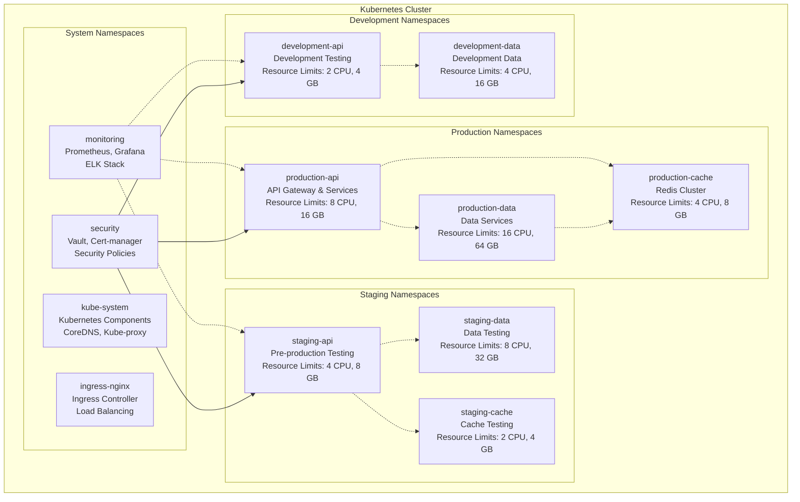
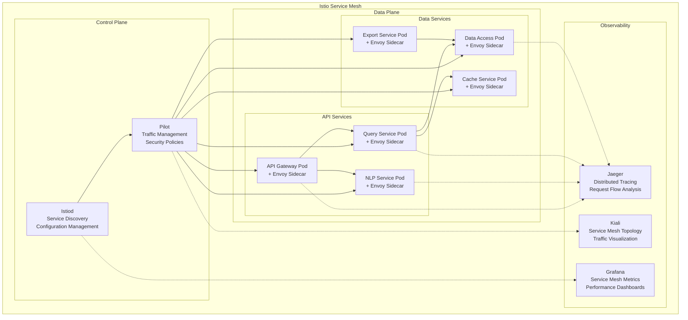
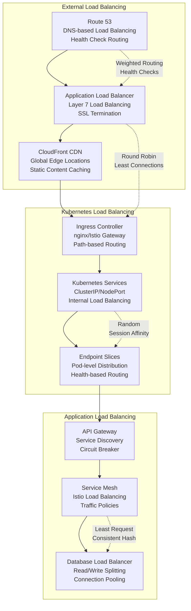
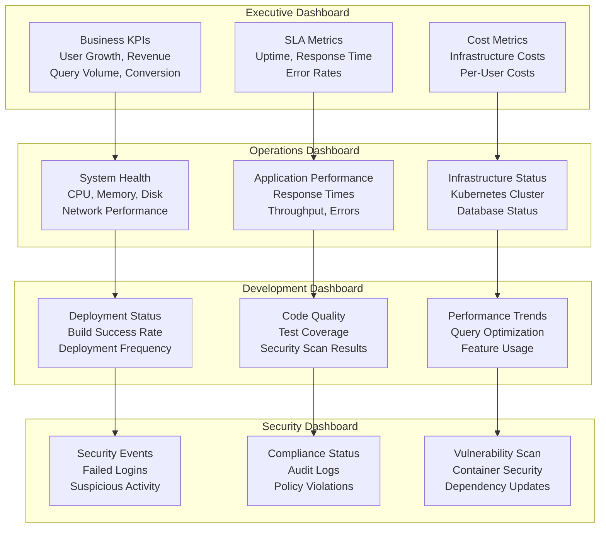
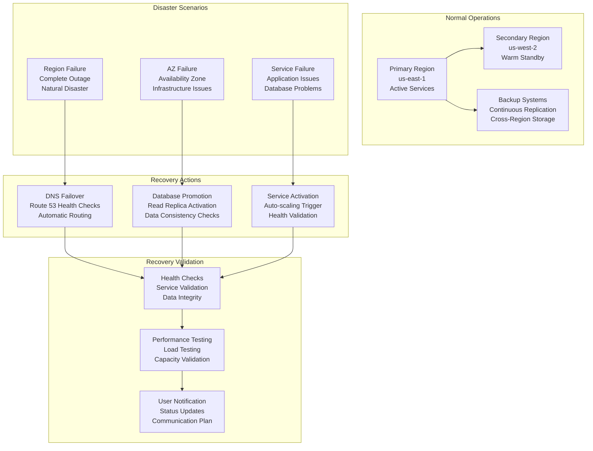

# CensusChat Infrastructure Architecture

## Overview

CensusChat's infrastructure architecture is designed for cloud-native deployment with Kubernetes orchestration, supporting high availability, auto-scaling, and multi-region deployment. The architecture follows infrastructure-as-code principles with comprehensive monitoring, automated deployment, and disaster recovery capabilities.

## Cloud Infrastructure Overview

```mermaid
graph TB
    subgraph "Multi-Region Deployment"
        subgraph "Primary Region (us-east-1)"
            subgraph "Production Cluster"
                PROD_K8S[Kubernetes Cluster<br/>3 Master Nodes<br/>6+ Worker Nodes]
                PROD_DB[Database Cluster<br/>Multi-AZ PostgreSQL<br/>DuckDB Nodes]
                PROD_CACHE[Redis Cluster<br/>6 Nodes (3M + 3R)<br/>High Availability]
            end
            
            subgraph "Support Services"
                MONITORING[Monitoring Stack<br/>Prometheus/Grafana<br/>ELK Stack]
                BACKUP[Backup Services<br/>Automated Backups<br/>Point-in-Time Recovery]
                SECURITY[Security Services<br/>Vault/Secrets<br/>Certificate Management]
            end
        end
        
        subgraph "Secondary Region (us-west-2)"
            subgraph "Disaster Recovery"
                DR_K8S[DR Kubernetes Cluster<br/>Warm Standby<br/>Auto-Scaling Ready]
                DR_DB[DR Database<br/>Read Replicas<br/>Failover Ready]
                DR_STORAGE[DR Storage<br/>Cross-Region Replication<br/>Encrypted Backups]
            end
        end
        
        subgraph "Edge Locations"
            CDN[Content Delivery Network<br/>Global Edge Caching<br/>DDoS Protection]
            EDGE_CACHE[Edge Caching<br/>Geographic Distribution<br/>Low Latency Access]
        end
    end
    
    subgraph "External Services"
        DNS[Route 53<br/>DNS Management<br/>Health Checks]
        LOAD_BALANCER[Application Load Balancer<br/>SSL Termination<br/>Auto Scaling]
        WAF[Web Application Firewall<br/>Security Rules<br/>DDoS Protection]
    end
    
    %% Connections
    DNS --> LOAD_BALANCER
    LOAD_BALANCER --> WAF
    WAF --> CDN
    CDN --> PROD_K8S
    
    PROD_K8S --> PROD_DB
    PROD_K8S --> PROD_CACHE
    PROD_K8S --> MONITORING
    
    PROD_DB -.-> DR_DB
    PROD_CACHE -.-> DR_STORAGE
    BACKUP -.-> DR_STORAGE
    
    MONITORING --> SECURITY
    SECURITY --> BACKUP
    
    %% Styling
    classDef primary fill:#e3f2fd
    classDef secondary fill:#f3e5f5
    classDef edge fill:#e8f5e8
    classDef external fill:#fff3e0
    
    class PROD_K8S,PROD_DB,PROD_CACHE,MONITORING,BACKUP,SECURITY primary
    class DR_K8S,DR_DB,DR_STORAGE secondary
    class CDN,EDGE_CACHE edge
    class DNS,LOAD_BALANCER,WAF external
```

## Kubernetes Architecture

### Cluster Configuration

**Kubernetes Cluster Specifications**:
```yaml
Cluster Setup:
  Control Plane:
    - 3 master nodes for high availability
    - etcd cluster with 3 nodes for state management
    - Load balancer for API server access
    - Automated backup of cluster state

  Worker Nodes:
    - Minimum 6 worker nodes across 3 availability zones
    - Auto-scaling from 6 to 50 nodes based on demand
    - Mixed instance types for cost optimization
    - Spot instances for non-critical workloads (30% cost savings)

  Node Specifications:
    Production Nodes:
      - Instance Type: c5.2xlarge (8 vCPU, 16 GB RAM)
      - Storage: 100 GB gp3 SSD for system, 500 GB for application data
      - Network: Enhanced networking with SR-IOV
      - Security: IMDSv2 enabled, encrypted EBS volumes

    Database Nodes:
      - Instance Type: r5.4xlarge (16 vCPU, 128 GB RAM)
      - Storage: 1 TB io2 SSD with 10,000 IOPS
      - Network: 10 Gbps network performance
      - Dedicated instances for data isolation

Kubernetes Version Management:
  - Version: 1.28+ with regular updates
  - Upgrade strategy: Rolling updates with blue-green deployment
  - Testing: Staging cluster for version validation
  - Rollback: Automated rollback procedures for failed upgrades
```

**Namespace Architecture**:


### Container Orchestration

**Deployment Strategy**:
```yaml
Deployment Patterns:
  Rolling Updates:
    - Zero-downtime deployments for all services
    - Health check validation before traffic routing
    - Automatic rollback on deployment failures
    - Canary deployments for high-risk changes

  Blue-Green Deployment:
    - Complete environment switching for major updates
    - Database migration validation and rollback
    - Full system testing in green environment
    - Traffic switching with instant rollback capability

  A/B Testing Deployment:
    - Feature flag integration for gradual rollouts
    - Traffic splitting based on user segments
    - Real-time metrics monitoring for feature performance
    - Automated rollback based on success metrics

Resource Management:
  CPU Allocation:
    - API Services: 0.5-2 CPU per pod
    - Data Services: 2-8 CPU per pod
    - Cache Services: 0.25-1 CPU per pod
    - Background Jobs: 0.1-0.5 CPU per pod

  Memory Allocation:
    - API Services: 512 MB - 2 GB per pod
    - Data Services: 4 GB - 16 GB per pod
    - Cache Services: 256 MB - 1 GB per pod
    - Background Jobs: 128 MB - 512 MB per pod

  Auto-scaling Configuration:
    - Horizontal Pod Autoscaler (HPA): CPU 70%, Memory 80%
    - Vertical Pod Autoscaler (VPA): Enabled for resource optimization
    - Cluster Autoscaler: Node scaling based on pending pods
    - Custom metrics scaling: Queue depth, response time
```

**Service Mesh Architecture**:


## Auto-Scaling and Load Balancing

### Horizontal Pod Autoscaler (HPA)

**Auto-scaling Configuration**:
```yaml
HPA Policies:
  API Gateway:
    - Min replicas: 3, Max replicas: 20
    - Target CPU: 70%, Target Memory: 80%
    - Scale-up: +2 pods every 30 seconds
    - Scale-down: -1 pod every 2 minutes
    - Custom metrics: Request rate (1000 RPS per pod)

  NLP Service:
    - Min replicas: 2, Max replicas: 15
    - Target CPU: 60%, Target Memory: 75%
    - Scale-up: +1 pod every 45 seconds
    - Scale-down: -1 pod every 3 minutes
    - Custom metrics: Queue depth (10 requests per pod)

  Query Processing:
    - Min replicas: 4, Max replicas: 25
    - Target CPU: 75%, Target Memory: 85%
    - Scale-up: +2 pods every 20 seconds
    - Scale-down: -1 pod every 90 seconds
    - Custom metrics: Query response time (<2s average)

  Data Access Service:
    - Min replicas: 3, Max replicas: 12
    - Target CPU: 65%, Target Memory: 70%
    - Scale-up: +1 pod every 60 seconds
    - Scale-down: -1 pod every 4 minutes
    - Custom metrics: Database connection pool usage

Cluster Auto-scaling:
  Node Scaling:
    - Min nodes: 6, Max nodes: 50
    - Scale-up triggers: Pending pods for >60 seconds
    - Scale-down triggers: Node utilization <50% for 10 minutes
    - Instance types: Mixed (on-demand + spot instances)
    - Cost optimization: 30% spot instances for non-critical workloads
```

### Load Balancing Strategy

**Multi-Layer Load Balancing**:


## Monitoring and Observability

### Comprehensive Monitoring Stack

**Monitoring Architecture**:
```yaml
Metrics Collection:
  Prometheus:
    - Cluster-level metrics collection
    - Application metrics with custom exporters
    - Infrastructure metrics (CPU, memory, disk, network)
    - Business metrics (query count, response time, user activity)
    - Retention: 30 days high-resolution, 1 year aggregated

  Grafana:
    - Real-time dashboards for operations team
    - Business intelligence dashboards for management
    - SLA monitoring and alerting visualization
    - Custom dashboard creation for different teams

Log Management:
  ELK Stack:
    - Elasticsearch: Log storage and search (30-day retention)
    - Logstash: Log processing and enrichment
    - Kibana: Log visualization and analysis
    - Filebeat: Log shipping from all containers

  Log Aggregation:
    - Structured logging with JSON format
    - Correlation IDs for request tracing
    - Log levels: DEBUG, INFO, WARN, ERROR, FATAL
    - Centralized log configuration management

Distributed Tracing:
  Jaeger:
    - End-to-end request tracing across microservices
    - Performance bottleneck identification
    - Service dependency mapping
    - Error propagation analysis
    - 7-day trace retention with sampling
```

**Monitoring Dashboards**:


### Alerting and Incident Management

**Alert Configuration**:
```yaml
Critical Alerts (P0 - Immediate Response):
  - System down: >5% error rate for >2 minutes
  - Database unavailable: Connection failures >90% for >1 minute
  - Security incident: Multiple failed authentication attempts
  - Data corruption: Query result validation failures
  - Response time: >5 seconds for >90% of requests for >5 minutes

High Priority Alerts (P1 - 15 minute response):
  - High error rate: >2% error rate for >5 minutes
  - Performance degradation: >3 second response time for >10 minutes
  - Resource exhaustion: >90% CPU/memory usage for >10 minutes
  - Cache miss rate: <70% cache hit rate for >15 minutes
  - Queue backup: >100 pending jobs for >5 minutes

Medium Priority Alerts (P2 - 1 hour response):
  - Moderate performance issues: >2 second response time for >15 minutes
  - Resource warnings: >80% CPU/memory usage for >30 minutes
  - Backup failures: Daily backup job failures
  - Certificate expiry: SSL certificates expiring within 30 days
  - Capacity warnings: Storage >85% full

Alerting Channels:
  - PagerDuty: Critical and high priority alerts
  - Slack: All alerts with escalation procedures
  - Email: Summary reports and low priority alerts
  - SMS: Critical alerts for on-call engineer
  - Dashboard: Real-time alert status visualization
```

## CI/CD Pipeline

### Automated Deployment Pipeline

**CI/CD Architecture**:

```mermaid
graph LR
    subgraph "Source Control"
        GIT[Git Repository<br/>Feature Branches<br/>Pull Requests]
        WEBHOOK[Git Webhooks<br/>Automated Triggers<br/>Event Notifications]
    end
    
    subgraph "Continuous Integration"
        BUILD[Build Stage<br/>Code Compilation<br/>Dependency Management]
        TEST[Test Stage<br/>Unit Tests<br/>Integration Tests]
        SECURITY[Security Stage<br/>SAST/DAST Scans<br/>Dependency Checks]
        QUALITY[Quality Gate<br/>Code Coverage<br/>Quality Metrics]
    end
    
    subgraph "Continuous Deployment"
        PACKAGE[Package Stage<br/>Container Build<br/>Image Scanning]
        DEPLOY_DEV[Deploy to Dev<br/>Automated Deployment<br/>Smoke Tests]
        DEPLOY_STAGE[Deploy to Staging<br/>Full Test Suite<br/>Performance Tests]
        DEPLOY_PROD[Deploy to Production<br/>Blue-Green Deployment<br/>Health Checks]
    end
    
    subgraph "Post-Deployment"
        MONITOR[Monitoring<br/>Health Checks<br/>Performance Metrics]
        ROLLBACK[Automated Rollback<br/>Failure Detection<br/>Quick Recovery]
        NOTIFY[Notifications<br/>Team Updates<br/>Deployment Reports]
    end
    
    %% Pipeline flow
    GIT --> WEBHOOK
    WEBHOOK --> BUILD
    BUILD --> TEST
    TEST --> SECURITY
    SECURITY --> QUALITY
    
    QUALITY --> PACKAGE
    PACKAGE --> DEPLOY_DEV
    DEPLOY_DEV --> DEPLOY_STAGE
    DEPLOY_STAGE --> DEPLOY_PROD
    
    DEPLOY_PROD --> MONITOR
    MONITOR --> ROLLBACK
    ROLLBACK --> NOTIFY
    
    %% Feedback loops
    ROLLBACK -.-> DEPLOY_STAGE
    MONITOR -.-> NOTIFY
```


**Pipeline Configuration**:
```yaml
CI Pipeline (GitHub Actions):
  Triggers:
    - Pull request creation and updates
    - Merge to main branch
    - Manual workflow dispatch
    - Scheduled nightly builds for security scans

  Build Stage:
    - Multi-architecture builds (amd64, arm64)
    - Dependency caching for faster builds
    - Build artifact generation and storage
    - Build time optimization (target: <5 minutes)

  Test Stage:
    - Unit tests with >80% coverage requirement
    - Integration tests against test database
    - API contract testing with OpenAPI validation
    - Performance tests with baseline comparison

  Security Stage:
    - Static application security testing (SAST)
    - Container image vulnerability scanning
    - Dependency vulnerability checking
    - License compliance verification

CD Pipeline (ArgoCD):
  Deployment Strategies:
    - GitOps workflow with declarative configurations
    - Automatic synchronization with Git repository
    - Progressive delivery with canary deployments
    - Rollback capabilities with Git revert

  Environment Promotion:
    - Development: Automatic deployment on feature branch merge
    - Staging: Automatic deployment with full test suite
    - Production: Manual approval with automated deployment
    - Rollback: Automated rollback on health check failures

  Deployment Validation:
    - Health check validation before traffic routing
    - Database migration verification
    - Performance baseline comparison
    - Security scan validation
```

## Disaster Recovery and Business Continuity

### Multi-Region Disaster Recovery

**DR Architecture**:
```yaml
Recovery Time Objectives (RTO):
  - Critical services: <15 minutes
  - Full system recovery: <1 hour
  - Complete data recovery: <4 hours
  - Historical data recovery: <24 hours

Recovery Point Objectives (RPO):
  - User data: <5 minutes (continuous replication)
  - Query cache: <30 minutes (acceptable data loss)
  - Analytics data: <1 hour (can be regenerated)
  - System configuration: <1 minute (version controlled)

DR Site Configuration:
  Primary Region (us-east-1):
    - Active-active deployment for API services
    - Primary database with synchronous replication
    - Full monitoring and alerting infrastructure
    - Complete backup and archival systems

  Secondary Region (us-west-2):
    - Warm standby with auto-scaling capability
    - Read replica databases with promotion capability
    - Reduced monitoring with alert forwarding
    - Cross-region backup replication

Failover Procedures:
  Automatic Failover:
    - DNS-based failover with health checks (5-minute RTO)
    - Database promotion with minimal data loss
    - Application service startup in secondary region
    - Monitoring and alerting activation

  Manual Failover:
    - Planned maintenance failover procedures
    - Complete system testing before traffic routing
    - Coordinated team communication and validation
    - Rollback procedures for failed failovers
```

**Business Continuity Planning**:


## Infrastructure as Code

### Terraform Configuration

**Infrastructure Management**:
```yaml
Terraform Structure:
  Environment Separation:
    - Development: terraform/environments/dev/
    - Staging: terraform/environments/staging/
    - Production: terraform/environments/prod/
    - Shared: terraform/modules/ (reusable components)

  Module Organization:
    - VPC and Networking: terraform/modules/networking/
    - EKS Cluster: terraform/modules/eks/
    - Database: terraform/modules/database/
    - Monitoring: terraform/modules/monitoring/
    - Security: terraform/modules/security/

  State Management:
    - Remote state storage in S3 with DynamoDB locking
    - State file encryption and access control
    - Environment-specific state files
    - Terraform Cloud integration for team collaboration

Configuration Management:
  Ansible Playbooks:
    - Server configuration and software installation
    - Application deployment and configuration
    - Security hardening and compliance
    - Automated patching and updates

  Kubernetes Manifests:
    - Helm charts for application deployment
    - Kustomize for environment-specific configurations
    - GitOps with ArgoCD for automated deployment
    - Secret management with Sealed Secrets
```

This comprehensive infrastructure architecture provides CensusChat with a robust, scalable, and highly available platform capable of supporting millions of users while maintaining sub-2 second query response times and 99.9% uptime requirements.